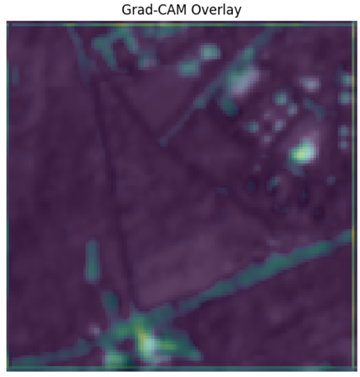
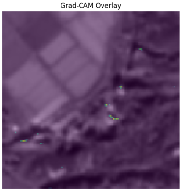

## Research accepted for publication at the 12th International Symposium on Field Monitoring in Geomechanics, Springer Nature (2026)
# Hybrid CNN–ResNet50 for Landslide Detection using Multi-Sensor Satellite Data

## Overview

This project implements a hybrid deep learning framework for automated landslide detection using fused Sentinel-1 (SAR) and Sentinel-2 (optical) satellite imagery.

The objective is to design a robust binary classification model capable of distinguishing landslide and non-landslide regions from multi-spectral and multi-polarization satellite data. The framework integrates domain-aware preprocessing, transfer learning, and interpretability techniques to improve generalization on geospatial imagery.

framework:

---

## Input Data

Each satellite tile contains 12 fused channels:

- **Sentinel-2 (Optical)**: Red, Green, Blue, Near Infrared  
- **Sentinel-1 Descending Orbit (SAR)**: VV, VH, VV-diff, VH-diff  
- **Sentinel-1 Ascending Orbit (SAR)**: VV, VH, VV-diff, VH-diff  

Preprocessing steps:
- Min-max normalization
- Resizing to 128×128 resolution
- Stratified 80/20 train-validation split
- Data augmentation (flips, rotation, Gaussian noise, blur)

---

## Model Architecture

The architecture consists of:

### 1️) 12 → 3 Channel Projection Block
- Convolutional layers with Batch Normalization and ReLU
- Learns optimal spectral fusion before backbone processing

### 2️) ResNet50 Backbone (ImageNet Pretrained)
- Deep residual feature extraction
- Initially frozen, later fine-tuned

### 3️) Classification Head
- Global Average Pooling
- Dense layers with Dropout
- Sigmoid output for binary classification

---

##  Data Processing Pipeline
Pipeline includes:

- Min-max normalization
- Data augmentation:
  - Horizontal & vertical flips
  - Random rotation
  - Gaussian noise
  - Gaussian blur
- tf.data optimized input pipeline

---

## Training Strategy

A two-phase transfer learning approach was adopted:

### Phase 1 – Warm-up
- ResNet50 backbone frozen
- Binary Cross-Entropy loss
- Projection block trained

### Phase 2 – Fine-Tuning
- ResNet50 unfrozen
- Combined **Focal + Dice Loss**
- Addresses class imbalance and overlap optimization

### Callbacks Used
- ModelCheckpoint  
- EarlyStopping  
- ReduceLROnPlateau  
- Custom F1ScoreCallback (dynamic threshold monitoring)

---

## Evaluation Metrics

Performance evaluated using:

- Accuracy
- Precision
- Recall
- F1-score
- ROC-AUC
- PR-AUC

Additional visualizations:

- ROC Curve →

  
  
- Precision–Recall Curve →

  

---

## 🔍 Model Interpretation (Grad-CAM)

Grad-CAM was applied to identify spatial regions influencing predictions.

The model demonstrates sensitivity to terrain texture and morphological patterns associated with landslide regions.

---
